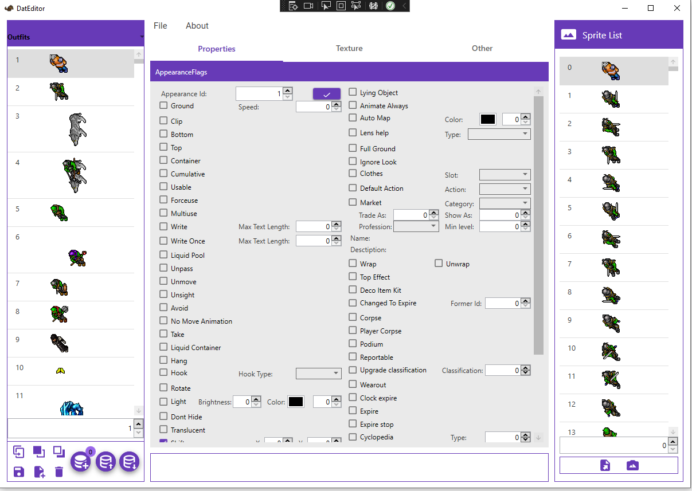

# Assets Editor Remastered

> 🇵🇹 Leia abaixo a seção em português.  
> 🇬🇧 Scroll further down for the English section.

---

## 🇵🇹 Visão geral

Assets Editor Remastered é uma versão atualizada do editor original criado por [Arch-Mina](https://github.com/Arch-Mina/Assets-Editor). Esta edição mantém todas as funcionalidades essenciais para modificar assets de clientes Tibia 12+ e 10.98, adicionando pequenos aprimoramentos de fluxo de trabalho e qualidade de vida.

### Novidades

- **Novos atalhos**  
  - `Ctrl+C`: copia os flags atuais.  
  - `Ctrl+V`: cola os flags copiados.  
  - `Ctrl+D`: duplica o item selecionado.  
  - `Ctrl+S`: salva o item.  
  - `Ctrl+G`: limpa todos os flags do item.
- **Abrir múltiplos clients**: agora é possível carregar um novo client sem fechar o editor, agilizando trocas rápidas.
- **Drag n’ Drop da lista**: reorganize os itens arrastando-os para a posição desejada enquanto mantém os IDs consistentes.
- **Importação sem duplicatas**: nova opção que impede importar assets que já existam na lista (verificação deixa o processo mais lento, mas evita conflitos).

Sinta-se à vontade para testar e enviar feedback. Muitas partes foram auxiliadas por IA; se isso não for confortável para você, basta não utilizar a ferramenta. Obrigado!

### Funcionalidades principais

- Compatibilidade com Tibia 12+ e 10.98.  
- Criar, copiar, duplicar e remover objetos.  
- Importar/exportar sprites e OTB.  
- Editor de spritesheets, janela avançada de busca e LogView.  
- OTB Editor e Import Manager específicos para 10.98.

### Como usar

1. Certifique-se de ter o **.NET 6.0** instalado.  
2. Compile o projeto ou use uma build existente.  
3. Carregue seus arquivos `assets`, `dat` e `spr` para começar a editar.

---

## 🇬🇧 Overview

Assets Editor Remastered is a refreshed take on the original tool by [Arch-Mina](https://github.com/Arch-Mina/Assets-Editor). It keeps the powerful feature set for Tibia 12+ and 10.98 asset work while adding a few workflow upgrades and shortcuts that make everyday editing faster.

### What’s new

- **Keyboard shortcuts**  
  - `Ctrl+C`: copy the current flags.  
  - `Ctrl+V`: paste saved flags.  
  - `Ctrl+D`: duplicate the selected item.  
  - `Ctrl+S`: save the item.  
  - `Ctrl+G`: clear all flags from the item.
- **Open multiple clients**: load a new client without restarting the editor.
- **Drag n’ drop**: reorder items by dragging them while preserving their IDs.
- **Duplicate-safe importing**: optional mode that skips items already present in your list (slower but safer).

Feel free to try these changes and send feedback. Many tweaks were built with AI assistance—if that is not for you, simply keep using the original version. Thank you!

### Core capabilities

- Full Tibia 12+ and 10.98 support.  
- Create/copy/delete/duplicate objects.  
- Import/export sprites, sheets, and OTB data.  
- Advanced search, sprite sheet editor, and LogView.  
- Dedicated OTB Editor and Import Manager for 10.98 workflows.

### Getting started

1. Install **.NET 6.0**.  
2. Build the solution or use a ready-made release.  
3. Load your `assets`, `dat`, and `spr` files and start editing.

---

### Créditos / Credits

- **Base project**: [Assets Editor](https://github.com/Arch-Mina/Assets-Editor) por Arch-Mina.  
- **Apoio opcional**: caso queira apoiar o trabalho original, considere o [PayPal do autor original](https://paypal.me/SpiderOT?country.x=EG&locale.x=en_US).
